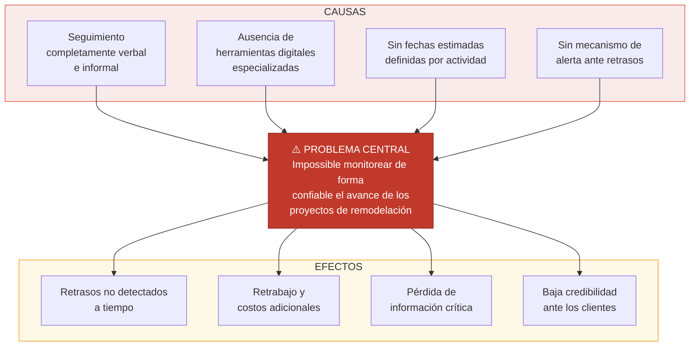

# INFORME SEMANAL
## Práctica Profesional — Ingeniería de Sistemas
### Semana 2: Identificación de Problemas en el Seguimiento de Obras

---

| **INFORMACIÓN GENERAL** | |
|---|---|
| **Estudiante** | María Camila Espinosa Flores |
| **Empresa** | R.E Amueblamiento de Espacios S.A.S. |
| **Cargo** | Secretaria Administrativa |
| **Ciudad** | Cali, Valle del Cauca |
| **Período** | Semana 2 (16 de Marzo – 20 de Marzo de 2026) |
| **Docente práctica** | Por asignar |

---

## 1. Objetivos de la Semana

Con base en los hallazgos del diagnóstico de la semana 1, la semana 2 estuvo orientada a profundizar el análisis de las dificultades operativas que enfrenta R.E Amueblamiento de Espacios S.A.S. en el seguimiento de sus proyectos. Los objetivos específicos fueron:

- Realizar entrevistas semiestructuradas con el supervisor y los trabajadores de obra.
- Clasificar y priorizar los problemas identificados según su impacto en el proceso.
- Construir el árbol del problema con causas y efectos.
- Definir los requerimientos preliminares del sistema de monitoreo web.

---

## 2. Levantamiento de Información

### 2.1. Entrevista con el supervisor Ricardo Espinosa

Se realizó una entrevista con el supervisor de obra, quien es el responsable directo de la coordinación de todos los proyectos activos. Las preguntas se orientaron a identificar los puntos de quiebre en el proceso de seguimiento. Los hallazgos más relevantes fueron:

- El supervisor atiende simultáneamente entre 2 y 4 proyectos en etapas distintas, lo que dificulta recordar el estado exacto de cada actividad sin consultar conversaciones previas de WhatsApp.
- No existe ningún mecanismo para registrar la fecha en que se completó una actividad ni quién la ejecutó.
- Los retrasos se detectan únicamente cuando el supervisor visita la obra físicamente o cuando un trabajador lo comunica de forma espontánea, lo cual puede ocurrir días después del evento.
- La empresa ha experimentado situaciones en las que actividades que dependen de otras comenzaron antes de que su predecesora estuviera terminada, generando retrabajo y costos adicionales.

### 2.2. Consulta con empleados de obra

Se realizó una consulta informal con dos trabajadores de planta. Sus observaciones principales fueron:

- Reciben instrucciones verbales o por WhatsApp, pero no tienen claridad sobre el orden exacto de las actividades ni las fechas estimadas de entrega.
- No disponen de ningún medio para reportar su avance de forma estructurada. Sólo envían fotografías o mensajes de texto cuando el supervisor lo solicita.
- Han recibido instrucciones contradictorias en más de una ocasión por olvido o confusión del supervisor sobre el estado del proyecto.

### 2.3. Revisión de registros existentes

Se revisaron los registros disponibles en la empresa (mensajes de WhatsApp, notas sueltas y memoria del supervisor). Se constató que:

- No existen documentos físicos ni digitales que describan el estado histórico de ningún proyecto.
- Las fotografías de avance están dispersas en grupos de WhatsApp sin ningún orden o etiqueta que permita vincularlas a una actividad o fase específica.
- No hay registro de los tiempos reales de ejecución de ninguna actividad, lo que impide comparar lo planeado vs. lo ejecutado.

---

## 3. Problemas Identificados y Clasificados

### 3.1. Tabla de problemas priorizados

| # | Problema | Categoría | Impacto | Frecuencia |
|---|----------|-----------|---------|------------|
| P1 | No existe registro del estado de actividades por proyecto | Trazabilidad | Alto | Siempre |
| P2 | Los retrasos se detectan tarde o no se detectan | Control | Alto | Frecuente |
| P3 | No hay visibilidad comparativa entre proyectos simultáneos | Gestión | Alto | Siempre |
| P4 | Las instrucciones se pierden en conversaciones de WhatsApp | Comunicación | Medio | Frecuente |
| P5 | No existe registro histórico de actividades completadas | Trazabilidad | Alto | Siempre |
| P6 | No hay mecanismo de alerta automática ante retrasos | Control | Alto | Siempre |
| P7 | El supervisor depende de su memoria para gestionar proyectos | Gestión | Alto | Siempre |
| P8 | No se documentan las fechas reales de ejecución | Registro | Medio | Siempre |

### 3.2. Árbol del Problema

---

## 4. Requerimientos Preliminares del Sistema

A partir del análisis de problemas, se definieron los siguientes requerimientos funcionales y no funcionales que debe cumplir el sistema de monitoreo:

### 4.1. Requerimientos funcionales

| ID | Requerimiento | Justificación |
|----|--------------|---------------|
| RF01 | Registrar proyectos con sus datos básicos (nombre, cliente, dirección, fechas) | Elimina P3 y P7 |
| RF02 | Registrar fases y actividades con orden, estado y fecha estimada | Elimina P1, P5 y P8 |
| RF03 | Cambiar el estado de una actividad (pendiente → en progreso → completada) | Elimina P1 y P4 |
| RF04 | Detectar automáticamente actividades con fecha estimada vencida | Elimina P2 y P6 |
| RF05 | Enviar alerta SMS al supervisor cuando se detecta un retraso | Elimina P6 |
| RF06 | Visualizar el estado de todos los proyectos activos en un dashboard | Elimina P3 |
| RF07 | Gestionar usuarios con roles (admin, supervisor, trabajador) | Elimina P4 |
| RF08 | Generar reportes de avance por proyecto | Complementa trazabilidad |

### 4.2. Requerimientos no funcionales

| ID | Requerimiento |
|----|--------------|
| RNF01 | Interfaz responsiva (accesible desde móvil y escritorio) |
| RNF02 | Disponibilidad 24/7 |
| RNF03 | Almacenamiento seguro en la nube (Supabase) |
| RNF04 | Tiempo de respuesta menor a 3 segundos por operación |

---

## 5. Próximos Pasos — Semana 3

La semana 3 estará dedicada al análisis detallado de las fases de los proyectos de remodelación, lo que implica:

- Documentar en detalle las actividades de cada fase (Obra Blanca y Amueblamiento).
- Establecer las dependencias entre actividades.
- Construir el modelo conceptual de datos del sistema.
- Identificar los casos de uso principales del sistema.

---

*María Camila Espinosa Flores*
*Secretaria Administrativa — Practicante*
*R.E Amueblamiento de Espacios S.A.S. — Cali, 2026*
