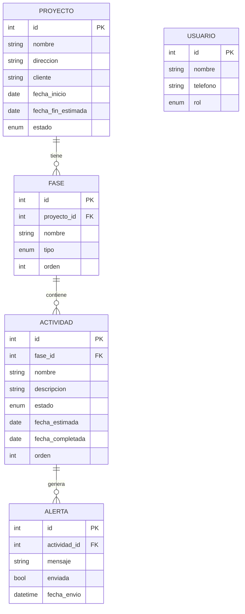
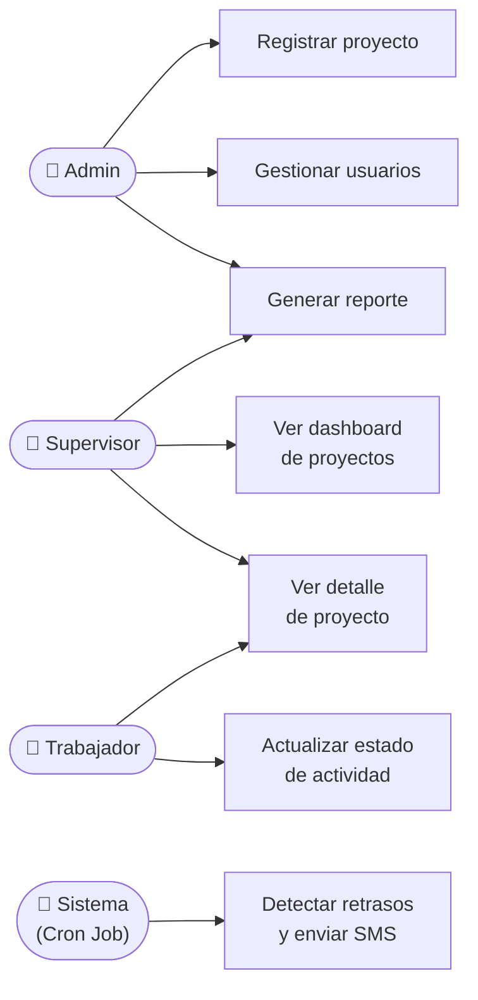

# INFORME SEMANAL
## Práctica Profesional — Ingeniería de Sistemas
### Semana 3: Análisis de las Fases de los Proyectos de Remodelación

---

| **INFORMACIÓN GENERAL** | |
|---|---|
| **Estudiante** | María Camila Espinosa Flores |
| **Empresa** | R.E Amueblamiento de Espacios S.A.S. |
| **Cargo** | Secretaria Administrativa |
| **Ciudad** | Cali, Valle del Cauca |
| **Período** | Semana 3 (23 de Marzo – 27 de Marzo de 2026) |
| **Docente práctica** | Por asignar |

---

## 1. Objetivo de la Semana

Esta semana estuvo dedicada al análisis en profundidad del proceso de remodelación que ejecuta R.E Amueblamiento de Espacios S.A.S. El objetivo fue documentar de forma sistemática las fases y actividades que componen cada proyecto, establecer sus dependencias y construir el modelo conceptual de datos que servirá como base para el diseño del sistema de monitoreo.

---

## 2. Modelo de Proceso de Remodelación

Tras el levantamiento de información con el supervisor Ricardo Espinosa, se estableció que cada proyecto de remodelación sigue un proceso estandarizado compuesto por exactamente **dos fases secuenciales**, cada una con un conjunto ordenado de actividades que deben ejecutarse en un orden definido.

### 2.1. Fase 1 — Obra Blanca

La Fase 1 comprende todas las intervenciones estructurales del apartamento: instalaciones eléctricas, hidráulicas, acabados de paredes, pisos y cielos rasos. Consta de **13 actividades** que deben ejecutarse en el siguiente orden:

| Orden | Actividad | Descripción |
|-------|-----------|-------------|
| 1 | Regatas | Apertura de canales en paredes para cambio de puntos eléctricos |
| 2 | Hidráulico | Instalación de tubería de agua caliente (baños, cocina, lavadero) y monocontrol |
| 3 | Tubería aire acondicionado | Instalación de cobre y drenaje para A/C |
| 4 | Panel yeso | Cielorrasos, descolgados y divisiones en drywall |
| 5 | Estuco | Aplicación de estuco en paredes y techos, tapado de huecos y regatas |
| 6 | Primera mano de pintura | Capa base de pintura en paredes y cielos |
| 7 | Eléctrico | Instalación de luces y tomas eléctricas |
| 8 | Mortero | Nivelación de piso y tapado de conexiones |
| 9 | Enchape | Instalación de cerámica o porcelanato en pisos, baños y zona húmeda |
| 10 | Retirar escombros | Limpieza y retiro de material sobrante de obra |
| 11 | Instalar sanitarios | Conexión de sanitarios con manguera |
| 12 | Instalar rejillas | Instalación en baños y zona de lavado |
| 13 | Aseo del apartamento | Limpieza general al finalizar obra blanca |

### 2.2. Fase 2 — Amueblamiento

La Fase 2 inicia únicamente cuando la Fase 1 está completamente terminada. Comprende la instalación de muebles, acabados decorativos y elementos de carpintería. Consta de **14 actividades**:

| Orden | Actividad | Descripción |
|-------|-----------|-------------|
| 1 | Toma de medidas para madera | Medición precisa para fabricación de muebles |
| 2 | Armar madera | Instalación de muebles: cocina, escritorio, lavadero, baños, closet, vestier |
| 3 | Toma de medidas para piedra | Medición para encimeras y mesones en piedra |
| 4 | Instalación de piedra | Colocación de piedra en cocina y 2 baños |
| 5 | Divisiones de baño | Instalación de 2 divisiones de baño (vidrio o similar) |
| 6 | Instalar lavamanos y grifería | Lavamanos, llaves de cocina y duchas conectadas con manguera |
| 7 | Accesorios de baño | Toalleros, ganchos, portarrollos y similares |
| 8 | Segunda mano de pintura | Capa final de pintura con acabado definitivo |
| 9 | Instalar estufa y campana | Conexión e instalación de estufa y extractora |
| 10 | Instalar guardaescobas | Guardaescobas en cocina y escritorio |
| 11 | Instalación de espejos | Espejos en baños |
| 12 | Fraguar apartamento | Aplicación de fragua en enchapes y pisos |
| 13 | Aseo del apartamento | Limpieza profunda final |
| 14 | Detallar madera | Ajustes y detalles finales en carpintería |

### 2.3. Flujo completo del proceso de remodelación

```mermaid
flowchart TD
    INICIO(["🏗️ INICIO DEL PROYECTO"]) --> F1

    subgraph F1["FASE 1 — OBRA BLANCA"]
        A1["1. Regatas"] --> A2["2. Hidráulico"]
        A2 --> A3["3. Tubería A/C"]
        A3 --> A4["4. Panel yeso"]
        A4 --> A5["5. Estuco"]
        A5 --> A6["6. 1ra mano pintura"]
        A6 --> A7["7. Eléctrico"]
        A7 --> A8["8. Mortero"]
        A8 --> A9["9. Enchape"]
        A9 --> A10["10. Retirar escombros"]
        A10 --> A11["11. Sanitarios"]
        A11 --> A12["12. Rejillas"]
        A12 --> A13["13. Aseo"]
    end

    A13 --> CONTROL{{"✅ ¿Fase 1\ncompleta?"}}
    CONTROL -- "No" --> A1
    CONTROL -- "Sí" --> F2

    subgraph F2["FASE 2 — AMUEBLAMIENTO"]
        B1["1. Medidas madera"] --> B2["2. Armar madera"]
        B2 --> B3["3. Medidas piedra"]
        B3 --> B4["4. Instalar piedra"]
        B4 --> B5["5. Divisiones baño"]
        B5 --> B6["6. Lavamanos y grifería"]
        B6 --> B7["7. Accesorios baño"]
        B7 --> B8["8. 2da mano pintura"]
        B8 --> B9["9. Estufa y campana"]
        B9 --> B10["10. Guardaescobas"]
        B10 --> B11["11. Espejos"]
        B11 --> B12["12. Fraguar"]
        B12 --> B13["13. Aseo final"]
        B13 --> B14["14. Detallar madera"]
    end

    B14 --> FIN(["🏠 ENTREGA AL CLIENTE"])

    style F1 fill:#d6eaf8,stroke:#2980b9
    style F2 fill:#d5f5e3,stroke:#27ae60
    style INICIO fill:#2c3e50,color:#fff
    style FIN fill:#27ae60,color:#fff
    style CONTROL fill:#f39c12,color:#fff
```

---

## 3. Modelo Conceptual de Datos

A partir del análisis del proceso de remodelación, se identificaron las entidades principales que debe gestionar el sistema y las relaciones entre ellas.

### 3.1. Entidades identificadas

| Entidad | Descripción |
|---------|-------------|
| **Proyecto** | Cada remodelación de apartamento es un proyecto con datos del cliente, dirección y fechas |
| **Fase** | Cada proyecto tiene 2 fases: Obra Blanca y Amueblamiento |
| **Actividad** | Cada fase tiene actividades ordenadas con estado y fecha estimada |
| **Usuario** | Personas que acceden al sistema con diferentes roles |
| **Alerta** | Notificaciones generadas cuando una actividad supera su fecha estimada |

### 3.2. Diagrama conceptual de relaciones

---

## 4. Casos de Uso Principales

---

## 5. Próximos Pasos — Semana 4

La semana 4 estará dedicada al diseño del sistema, enfocado en la arquitectura general y la base de datos:

- Definir la arquitectura de tres capas del sistema (frontend, backend, base de datos).
- Diseñar el esquema definitivo de la base de datos con todos los campos y restricciones.
- Crear las tablas en Supabase y verificar su funcionamiento.
- Establecer la estructura de carpetas del repositorio y las convenciones de código.

---

*María Camila Espinosa Flores*
*Secretaria Administrativa — Practicante*
*R.E Amueblamiento de Espacios S.A.S. — Cali, 2026*
