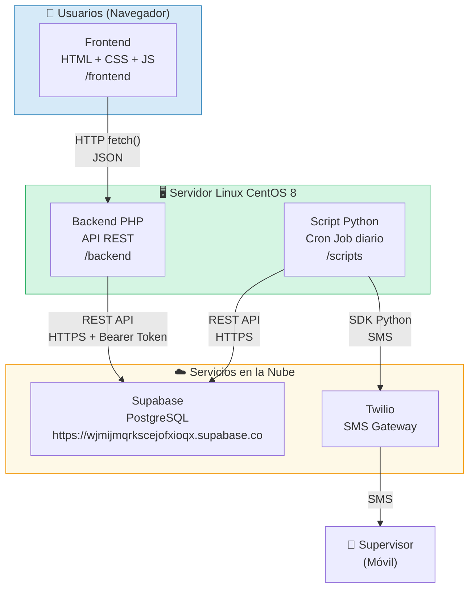
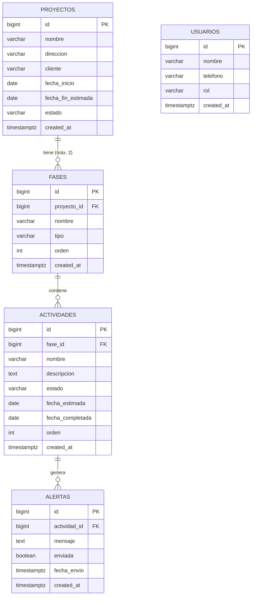

# INFORME SEMANAL
## Práctica Profesional — Ingeniería de Sistemas
### Semana 4: Diseño del Sistema — Arquitectura y Base de Datos

---

| **INFORMACIÓN GENERAL** | |
|---|---|
| **Estudiante** | María Camila Espinosa Flores |
| **Empresa** | R.E Amueblamiento de Espacios S.A.S. |
| **Cargo** | Secretaria Administrativa |
| **Ciudad** | Cali, Valle del Cauca |
| **Período** | Semana 4 (30 de Marzo – 3 de Abril de 2026) |
| **Docente práctica** | Por asignar |

---

## 1. Objetivo de la Semana

Esta semana se inició la fase de diseño del sistema de monitoreo web. El trabajo se centró en definir la arquitectura tecnológica del sistema, diseñar el esquema de base de datos relacional y documentar las decisiones técnicas que guiarán el desarrollo posterior.

---

## 2. Arquitectura General del Sistema

### 2.1. Descripción de la arquitectura

El sistema se diseñó bajo una arquitectura de **tres capas** desacopladas, lo cual permite que cada componente pueda ser mantenido y actualizado de forma independiente:

- **Capa de presentación (Frontend):** Interfaz web construida en HTML, CSS y JavaScript vanilla. Se ejecuta en el navegador del usuario y consume la API REST del backend mediante `fetch`.
- **Capa de negocio (Backend):** API REST desarrollada en PHP puro. Recibe peticiones HTTP del frontend, aplica la lógica de negocio, valida datos y se comunica con Supabase.
- **Capa de datos (Base de datos):** Base de datos PostgreSQL alojada en Supabase. El backend accede a ella mediante la API REST de Supabase utilizando la clave de servicio.
- **Capa de automatización (Scripts Python):** Proceso independiente que se ejecuta como cron job diario. Consulta la base de datos, detecta retrasos y envía alertas SMS a través de Twilio.

### 2.2. Diagrama de arquitectura del sistema



---

## 3. Diseño de la Base de Datos

### 3.1. Stack de base de datos

Se seleccionó **Supabase** como plataforma de base de datos por las siguientes razones:

| Criterio | Justificación |
|----------|---------------|
| Motor | PostgreSQL — robusto, relacional, maduro |
| Acceso | API REST lista sin configuración adicional de servidor |
| Costo | Plan gratuito suficiente para el alcance del proyecto |
| Seguridad | Autenticación por API key, conexión HTTPS cifrada |
| Escalabilidad | Permite crecer sin cambiar de tecnología |

### 3.2. Esquema definitivo de la base de datos

#### Tabla: `proyectos`

| Campo | Tipo | Restricciones | Descripción |
|-------|------|---------------|-------------|
| `id` | BIGINT | PK, auto-increment | Identificador único |
| `nombre` | VARCHAR(255) | NOT NULL | Nombre del proyecto |
| `direccion` | VARCHAR(255) | NOT NULL | Dirección del apartamento |
| `cliente` | VARCHAR(255) | NOT NULL | Nombre del cliente |
| `fecha_inicio` | DATE | NOT NULL | Fecha de inicio de la obra |
| `fecha_fin_estimada` | DATE | NOT NULL | Fecha estimada de entrega |
| `estado` | VARCHAR(20) | DEFAULT 'activo' | activo / pausado / completado |
| `created_at` | TIMESTAMPTZ | DEFAULT now() | Fecha de registro |

#### Tabla: `fases`

| Campo | Tipo | Restricciones | Descripción |
|-------|------|---------------|-------------|
| `id` | BIGINT | PK, auto-increment | Identificador único |
| `proyecto_id` | BIGINT | FK → proyectos.id | Proyecto al que pertenece |
| `nombre` | VARCHAR(255) | NOT NULL | Nombre de la fase |
| `tipo` | VARCHAR(30) | NOT NULL | obra_blanca / amueblamiento |
| `orden` | INT | NOT NULL | 1 (Obra Blanca) o 2 (Amueblamiento) |
| `created_at` | TIMESTAMPTZ | DEFAULT now() | Fecha de registro |

#### Tabla: `actividades`

| Campo | Tipo | Restricciones | Descripción |
|-------|------|---------------|-------------|
| `id` | BIGINT | PK, auto-increment | Identificador único |
| `fase_id` | BIGINT | FK → fases.id | Fase a la que pertenece |
| `nombre` | VARCHAR(255) | NOT NULL | Nombre de la actividad |
| `descripcion` | TEXT | | Descripción detallada |
| `estado` | VARCHAR(20) | DEFAULT 'pendiente' | pendiente / en_progreso / completada / retrasada |
| `fecha_estimada` | DATE | | Fecha límite estimada |
| `fecha_completada` | DATE | | Fecha real de finalización |
| `orden` | INT | NOT NULL | Posición dentro de la fase |
| `created_at` | TIMESTAMPTZ | DEFAULT now() | Fecha de registro |

#### Tabla: `usuarios`

| Campo | Tipo | Restricciones | Descripción |
|-------|------|---------------|-------------|
| `id` | BIGINT | PK, auto-increment | Identificador único |
| `nombre` | VARCHAR(255) | NOT NULL | Nombre completo |
| `telefono` | VARCHAR(20) | | Número de teléfono |
| `rol` | VARCHAR(20) | NOT NULL | admin / supervisor / trabajador |
| `created_at` | TIMESTAMPTZ | DEFAULT now() | Fecha de registro |

#### Tabla: `alertas`

| Campo | Tipo | Restricciones | Descripción |
|-------|------|---------------|-------------|
| `id` | BIGINT | PK, auto-increment | Identificador único |
| `actividad_id` | BIGINT | FK → actividades.id | Actividad en retraso |
| `mensaje` | TEXT | NOT NULL | Contenido del SMS enviado |
| `enviada` | BOOLEAN | DEFAULT false | Si el SMS fue enviado |
| `fecha_envio` | TIMESTAMPTZ | | Cuándo se envió la alerta |
| `created_at` | TIMESTAMPTZ | DEFAULT now() | Fecha de registro |

### 3.3. Diagrama Entidad-Relación (ER)



---

## 4. Estructura del Repositorio

Se definió la estructura de carpetas del repositorio en GitHub, siguiendo una organización que separa claramente cada capa del sistema:

```
Planmejora/
├── backend/
│   ├── config/
│   │   └── database.php        # Conexión a Supabase
│   ├── api/
│   │   ├── proyectos.php       # CRUD proyectos
│   │   ├── fases.php           # CRUD fases
│   │   ├── actividades.php     # CRUD + cambio de estado
│   │   ├── alertas.php         # Consulta y registro
│   │   └── usuarios.php        # CRUD usuarios
│   └── helpers/
│       └── auth.php            # Validación de roles
├── frontend/
│   ├── index.html              # Login
│   ├── dashboard.html          # Vista general proyectos
│   ├── proyecto.html           # Detalle de proyecto
│   ├── reportes.html           # Reportes exportables
│   └── assets/
│       ├── css/
│       └── js/
├── scripts/
│   ├── check_delays.py         # Detecta retrasos
│   ├── send_sms.py             # Envía SMS por Twilio
│   └── cron_alertas.py         # Script principal cron
├── database/
│   ├── schema.sql              # Creación de tablas
│   ├── seed.sql                # Datos de prueba
│   └── migrations/
├── docs/                       # Informes semanales
├── .env                        # Variables de entorno
├── .env.example
└── .gitignore
```

---

## 5. Justificación del Stack Tecnológico

| Tecnología | Alternativas consideradas | Razón de selección |
|------------|--------------------------|-------------------|
| PHP (backend) | Node.js, Python Flask | Disponible en el servidor CentOS, dominio previo |
| Vanilla JS (frontend) | React, Vue | Sin dependencias de npm, menor complejidad de despliegue |
| Supabase | MySQL local, Firebase | PostgreSQL gestionado, API REST lista, plan gratuito |
| Python (scripts) | PHP cron, Node.js | Ecosistema robusto para automatización y SDK de Twilio |
| Twilio | Email, notificaciones web | SMS garantiza llegada sin importar conectividad del supervisor |

---

## 6. Próximos Pasos — Semana 5

La semana 5 continuará con el diseño del sistema, enfocándose en las interfaces de usuario y la definición completa de la API REST:

- Diseñar los wireframes de las pantallas principales del sistema.
- Definir todos los endpoints de la API REST con sus parámetros y respuestas.
- Documentar el flujo de navegación entre pantallas.
- Preparar el entorno de desarrollo local.

---

*María Camila Espinosa Flores*
*Secretaria Administrativa — Practicante*
*R.E Amueblamiento de Espacios S.A.S. — Cali, 2026*
