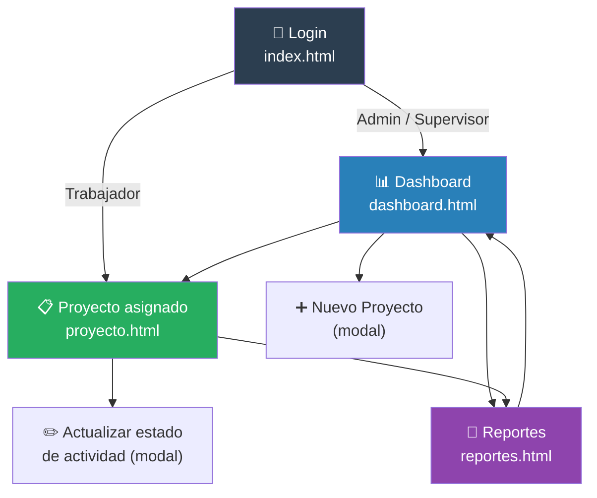
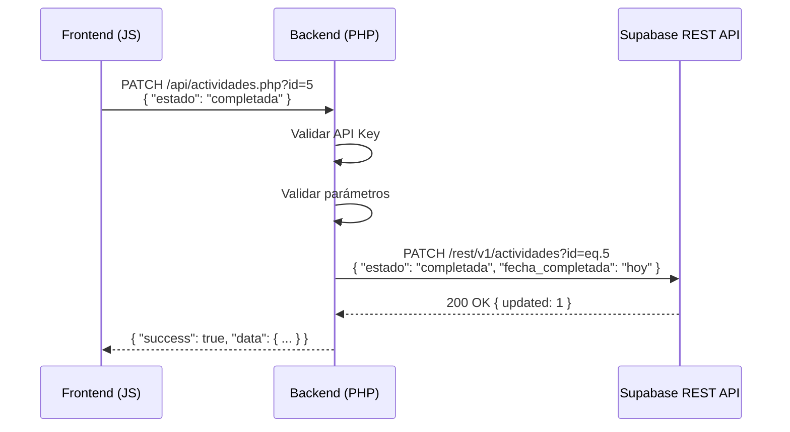

# INFORME SEMANAL
## Práctica Profesional — Ingeniería de Sistemas
### Semana 5: Diseño del Sistema — Interfaces de Usuario y API REST

---

| **INFORMACIÓN GENERAL** | |
|---|---|
| **Estudiante** | María Camila Espinosa Flores |
| **Empresa** | R.E Amueblamiento de Espacios S.A.S. |
| **Cargo** | Secretaria Administrativa |
| **Ciudad** | Cali, Valle del Cauca |
| **Período** | Semana 5 (6 de Abril – 10 de Abril de 2026) |
| **Docente práctica** | Por asignar |

---

## 1. Objetivo de la Semana

Esta semana se completó la fase de diseño del sistema con el trabajo sobre las interfaces de usuario y la especificación completa de la API REST. Se definieron los wireframes de las pantallas principales, el flujo de navegación entre ellas y la estructura de todos los endpoints que el backend PHP deberá implementar.

---

## 2. Diseño de Interfaces de Usuario

El sistema contará con cuatro pantallas principales. El diseño prioriza la simplicidad y la facilidad de uso, considerando que los usuarios (supervisor y trabajadores) acceden principalmente desde dispositivos móviles en obra.

### 2.1. Pantalla 1 — Login (`index.html`)

La pantalla de acceso solicita usuario y contraseña. Valida el rol del usuario y redirige al dashboard según sus permisos.

```
┌─────────────────────────────────────────┐
│                                         │
│         🏗️ R.E Amueblamiento            │
│       Sistema de Monitoreo de Obras     │
│                                         │
│   ┌─────────────────────────────────┐   │
│   │  👤  Usuario                    │   │
│   └─────────────────────────────────┘   │
│                                         │
│   ┌─────────────────────────────────┐   │
│   │  🔒  Contraseña                 │   │
│   └─────────────────────────────────┘   │
│                                         │
│   ┌─────────────────────────────────┐   │
│   │         INGRESAR AL SISTEMA     │   │
│   └─────────────────────────────────┘   │
│                                         │
└─────────────────────────────────────────┘
```

### 2.2. Pantalla 2 — Dashboard (`dashboard.html`)

Vista general de todos los proyectos activos. Muestra el porcentaje de avance de cada uno y permite detectar de un vistazo cuáles tienen actividades retrasadas.

```
┌──────────────────────────────────────────────────────────┐
│  🏗️ Monitoreo de Proyectos          [+ Nuevo proyecto]   │
├──────────────────────────────────────────────────────────┤
│  Filtro: [Todos ▼]   [Activos ▼]   [Buscar...]           │
├──────────────────────────────────────────────────────────┤
│ ┌─────────────────────────┐ ┌─────────────────────────┐  │
│ │ 🟢 Proyecto A           │ │ 🔴 Proyecto B            │  │
│ │ Cra 5 #12-34            │ │ Av. Roosevelt #45        │  │
│ │ Cliente: Juan García    │ │ Cliente: Ana Martínez    │  │
│ │ Fase: Obra Blanca       │ │ Fase: Amueblamiento      │  │
│ │ ████████░░ 75%          │ │ ████░░░░░░ 40%           │  │
│ │ ⚠️ 1 actividad retrasada│ │ ✅ Al día                │  │
│ │ [Ver detalle]           │ │ [Ver detalle]            │  │
│ └─────────────────────────┘ └─────────────────────────┘  │
└──────────────────────────────────────────────────────────┘
```

### 2.3. Pantalla 3 — Detalle de Proyecto (`proyecto.html`)

Vista completa de un proyecto con sus dos fases y el listado de actividades en forma de checklist. Permite cambiar el estado de cada actividad.

```
┌──────────────────────────────────────────────────────────┐
│  ← Volver    🏗️ Proyecto A — Cra 5 #12-34                │
│              Cliente: Juan García  |  Inicio: 01/04/2026  │
├──────────────────────────────────────────────────────────┤
│  ┌─── FASE 1: OBRA BLANCA ─────────────────────────────┐ │
│  │ ✅ 1. Regatas              Completada   12/04/2026   │ │
│  │ ✅ 2. Hidráulico           Completada   15/04/2026   │ │
│  │ 🔄 3. Tubería A/C          En progreso              │ │
│  │ ⏳ 4. Panel yeso           Pendiente    Est: 25/04   │ │
│  │ ⚠️ 5. Estuco               RETRASADA    Est: 20/04   │ │
│  │    ...                                               │ │
│  └─────────────────────────────────────────────────────┘ │
│                                                           │
│  ┌─── FASE 2: AMUEBLAMIENTO ───────────────────────────┐ │
│  │  (Bloqueada hasta completar Fase 1)                  │ │
│  └─────────────────────────────────────────────────────┘ │
└──────────────────────────────────────────────────────────┘
```

### 2.4. Pantalla 4 — Reportes (`reportes.html`)

Permite generar reportes de avance por proyecto con opción de exportar.

```
┌──────────────────────────────────────────────────────────┐
│  📊 Reportes de Avance                                    │
├──────────────────────────────────────────────────────────┤
│  Proyecto: [Seleccionar ▼]   Fase: [Todas ▼]             │
│                                [Generar reporte]         │
├──────────────────────────────────────────────────────────┤
│  Proyecto A — Informe al 10/04/2026                      │
│  ─────────────────────────────────────────────────────   │
│  Total actividades:  27   Completadas: 8   Retrasadas: 1  │
│  Avance Fase 1:  62%       Avance Fase 2:  0%            │
│                                                           │
│  Actividades retrasadas:                                  │
│  ⚠️  Estuco — Estimada: 20/04 — Estado: Retrasada        │
│                                                           │
│                              [📄 Exportar PDF]           │
└──────────────────────────────────────────────────────────┘
```

---

## 3. Flujo de Navegación



---

## 4. Diseño de la API REST

### 4.1. Convenciones generales

- Todas las respuestas en formato **JSON**
- Autenticación mediante **API Key** en el header `Authorization: Bearer {key}`
- Métodos HTTP estándar: GET, POST, PUT, PATCH, DELETE
- Respuestas con estructura uniforme: `{ "success": bool, "data": any, "error": string }`

### 4.2. Endpoints definidos

#### Proyectos

| Método | Endpoint | Descripción |
|--------|----------|-------------|
| GET | `/api/proyectos.php` | Listar todos los proyectos |
| GET | `/api/proyectos.php?id={id}` | Obtener un proyecto por ID |
| POST | `/api/proyectos.php` | Crear nuevo proyecto |
| PUT | `/api/proyectos.php?id={id}` | Actualizar proyecto |
| PATCH | `/api/proyectos.php?id={id}` | Cambiar estado del proyecto |
| DELETE | `/api/proyectos.php?id={id}` | Eliminar proyecto |

#### Fases

| Método | Endpoint | Descripción |
|--------|----------|-------------|
| GET | `/api/fases.php?proyecto_id={id}` | Fases de un proyecto |
| POST | `/api/fases.php` | Crear fase |
| PUT | `/api/fases.php?id={id}` | Actualizar fase |

#### Actividades

| Método | Endpoint | Descripción |
|--------|----------|-------------|
| GET | `/api/actividades.php?fase_id={id}` | Actividades de una fase |
| POST | `/api/actividades.php` | Crear actividad |
| PUT | `/api/actividades.php?id={id}` | Actualizar actividad |
| PATCH | `/api/actividades.php?id={id}` | Cambiar estado de actividad |

#### Usuarios y Alertas

| Método | Endpoint | Descripción |
|--------|----------|-------------|
| GET | `/api/usuarios.php` | Listar usuarios |
| POST | `/api/usuarios.php` | Crear usuario |
| GET | `/api/alertas.php` | Consultar alertas enviadas |
| POST | `/api/alertas.php` | Registrar alerta |

### 4.3. Flujo de una petición típica



---

## 5. Próximos Pasos — Semana 6

La semana 6 estará dedicada a la creación formal de los formatos de seguimiento y la verificación del esquema de base de datos en Supabase:

- Verificar la creación de todas las tablas en Supabase y sus relaciones.
- Generar el archivo `database/schema.sql` con el script completo de creación.
- Definir las validaciones de datos en el backend.
- Documentar el modelo de roles y permisos del sistema.

---

*María Camila Espinosa Flores*
*Secretaria Administrativa — Practicante*
*R.E Amueblamiento de Espacios S.A.S. — Cali, 2026*
