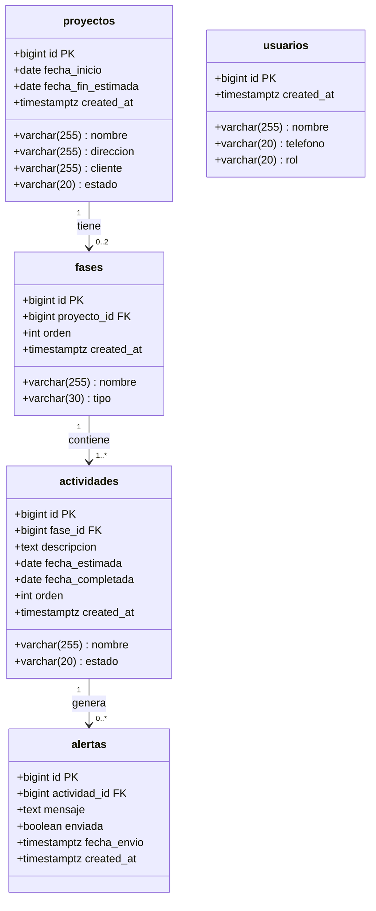
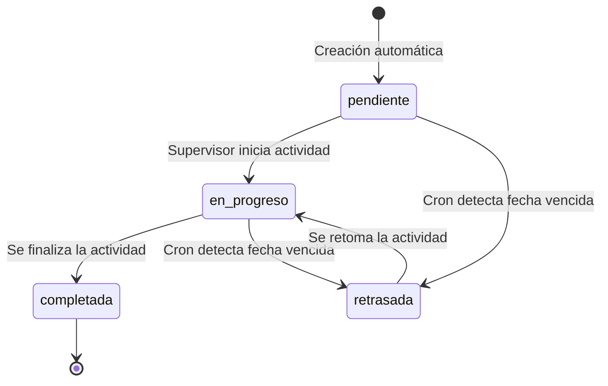
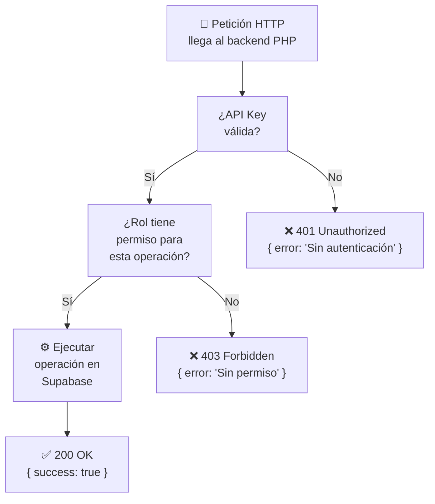

# INFORME SEMANAL
## Práctica Profesional — Ingeniería de Sistemas
### Semana 6: Creación de Formatos de Seguimiento y Verificación de Base de Datos

---

| **INFORMACIÓN GENERAL** | |
|---|---|
| **Estudiante** | María Camila Espinosa Flores |
| **Empresa** | R.E Amueblamiento de Espacios S.A.S. |
| **Cargo** | Secretaria Administrativa |
| **Ciudad** | Cali, Valle del Cauca |
| **Período** | Semana 6 (13 de Abril – 17 de Abril de 2026) |
| **Docente práctica** | Por asignar |

---

## 1. Objetivo de la Semana

Esta semana estuvo orientada a la formalización de los formatos de seguimiento de proyectos y a la verificación del esquema de base de datos en Supabase. Se generaron los scripts SQL de creación de tablas, se documentaron las validaciones del sistema y se definió el modelo de roles y permisos.

---

## 2. Creación de Tablas en Supabase

### 2.1. Script de creación (`schema.sql`)

Se creó el script SQL completo que define la estructura de la base de datos en Supabase (PostgreSQL). Las cinco tablas del sistema fueron creadas y verificadas en el proyecto en la nube.

**URL del proyecto Supabase:** `https://wjmijmqrkscejofxioqx.supabase.co`

Las tablas creadas y verificadas son:

| Tabla | Registros iniciales | Estado |
|-------|-------------------|--------|
| `proyectos` | 0 | ✅ Creada |
| `fases` | 0 | ✅ Creada |
| `actividades` | 0 | ✅ Creada |
| `usuarios` | 0 | ✅ Creada |
| `alertas` | 0 | ✅ Creada |

### 2.2. Diagrama de tablas con campos y tipos



---

## 3. Formatos de Seguimiento Definidos

### 3.1. Formato de registro de proyecto

Se definió la información mínima necesaria para registrar un nuevo proyecto en el sistema:

| Campo | Tipo | Obligatorio | Validación |
|-------|------|-------------|------------|
| Nombre del proyecto | Texto | Sí | Mínimo 5 caracteres |
| Dirección | Texto | Sí | Mínimo 10 caracteres |
| Nombre del cliente | Texto | Sí | Mínimo 3 caracteres |
| Fecha de inicio | Fecha | Sí | No puede ser pasada |
| Fecha estimada de entrega | Fecha | Sí | Posterior a fecha de inicio |
| Estado inicial | Selección | Sí | Valor por defecto: "activo" |

Al crear un proyecto, el sistema genera automáticamente las 2 fases y las 27 actividades estándar con estado "pendiente".

### 3.2. Formato de seguimiento de actividad

Cuando un usuario actualiza el estado de una actividad, el sistema registra:

| Campo | Descripción |
|-------|-------------|
| Estado nuevo | pendiente / en_progreso / completada / retrasada |
| Fecha de completado | Se registra automáticamente si el estado es "completada" |
| Usuario que actualizó | Trazabilidad del cambio |

### 3.3. Valores válidos de estado por entidad



---

## 4. Modelo de Roles y Permisos

### 4.1. Definición de roles

El sistema contempla tres roles de usuario, cada uno con acceso diferenciado a las funcionalidades:

| Funcionalidad | Admin | Supervisor | Trabajador |
|--------------|:-----:|:----------:|:----------:|
| Ver dashboard de proyectos | ✅ | ✅ | ❌ |
| Crear / editar proyectos | ✅ | ❌ | ❌ |
| Ver detalle de proyecto | ✅ | ✅ | ✅ |
| Actualizar estado de actividad | ✅ | ✅ | ✅ |
| Ver reportes | ✅ | ✅ | ❌ |
| Gestionar usuarios | ✅ | ❌ | ❌ |
| Ver historial de alertas | ✅ | ✅ | ❌ |

### 4.2. Flujo de validación de roles en el backend



---

## 5. Validaciones del Sistema

### 5.1. Validaciones en el backend (PHP)

| Tipo | Regla |
|------|-------|
| Proyectos | La fecha de fin estimada debe ser posterior a la fecha de inicio |
| Actividades | El orden debe ser único dentro de una misma fase |
| Actividades | La fecha estimada no puede ser anterior a la fecha de inicio del proyecto |
| Fases | Un proyecto no puede tener más de 2 fases |
| Alertas | No se puede registrar una alerta duplicada para la misma actividad en el mismo día |

### 5.2. Respuestas de error estandarizadas

```json
{
  "success": false,
  "error": "Descripción del error",
  "code": 400
}
```

---

## 6. Próximos Pasos — Semana 7

La semana 7 estará dedicada al diseño del sistema de alertas automáticas:

- Definir la lógica de detección de retrasos (comparación de fecha_estimada vs. fecha actual).
- Diseñar el script Python `check_delays.py` y su integración con Twilio.
- Documentar la configuración del cron job en el servidor Linux.
- Definir el formato del mensaje SMS que recibirá el supervisor.

---

*María Camila Espinosa Flores*
*Secretaria Administrativa — Practicante*
*R.E Amueblamiento de Espacios S.A.S. — Cali, 2026*
