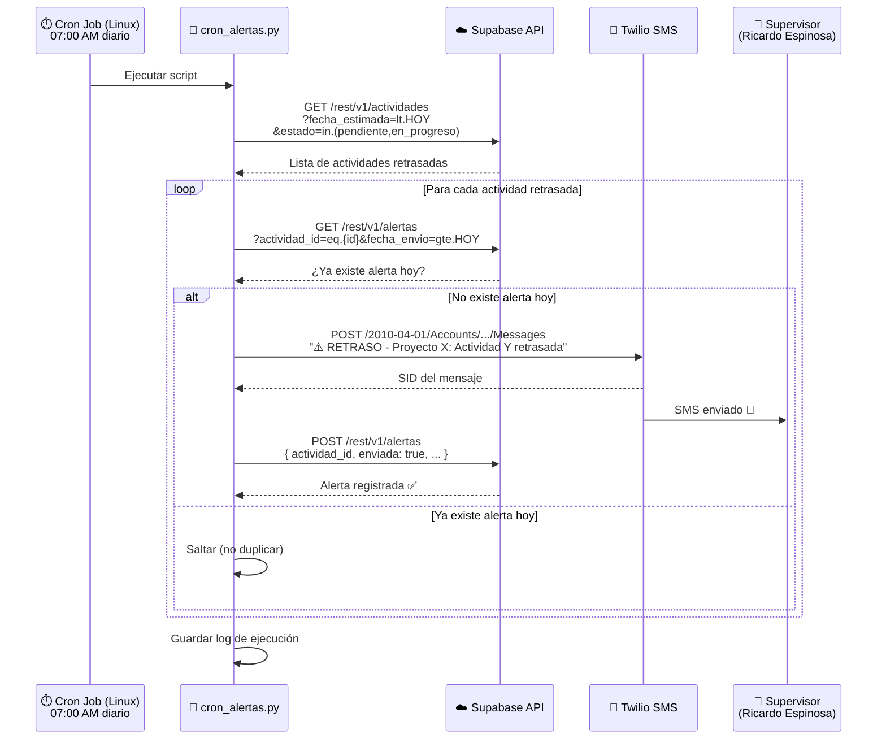
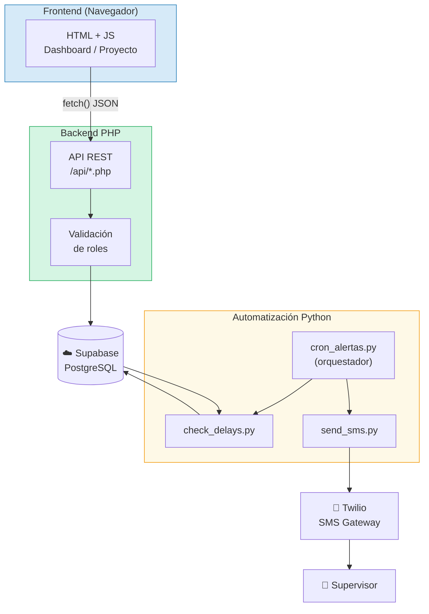

# INFORME SEMANAL
## Práctica Profesional — Ingeniería de Sistemas
### Semana 7: Diseño del Sistema de Alertas Automáticas

---

| **INFORMACIÓN GENERAL** | |
|---|---|
| **Estudiante** | María Camila Espinosa Flores |
| **Empresa** | R.E Amueblamiento de Espacios S.A.S. |
| **Cargo** | Secretaria Administrativa |
| **Ciudad** | Cali, Valle del Cauca |
| **Período** | Semana 7 (20 de Abril – 24 de Abril de 2026) |
| **Docente práctica** | Por asignar |

---

## 1. Objetivo de la Semana

Esta semana estuvo dedicada al diseño completo del módulo de alertas automáticas por SMS. Este componente es uno de los más importantes del sistema, ya que resuelve directamente el problema identificado en el diagnóstico: los retrasos en los proyectos no se detectan a tiempo. Se diseñó la lógica de detección, la integración con Twilio y la configuración del cron job en el servidor Linux.

---

## 2. Sistema de Alertas por Retraso

### 2.1. Definición de retraso

Una actividad se considera **retrasada** cuando se cumplan las siguientes condiciones simultáneamente:

1. La `fecha_estimada` de la actividad es anterior a la fecha actual del sistema.
2. El `estado` de la actividad es `pendiente` o `en_progreso` (es decir, no está `completada`).

La detección se realiza consultando la base de datos en Supabase y comparando la fecha estimada de cada actividad activa con la fecha del día en que se ejecuta el script.

### 2.2. Criterios de alerta

Para evitar enviar mensajes duplicados, el sistema aplica las siguientes reglas:

| Regla | Descripción |
|-------|-------------|
| Una alerta por actividad por día | Si ya se envió una alerta hoy para una actividad, no se vuelve a enviar |
| Solo proyectos activos | No se generan alertas para proyectos en estado `pausado` o `completado` |
| Solo actividades con fecha estimada | Actividades sin `fecha_estimada` no generan alertas |
| Registro obligatorio | Cada alerta enviada queda registrada en la tabla `alertas` |

---

## 3. Diseño del Script Python

### 3.1. Módulos y responsabilidades

El sistema de alertas está compuesto por tres scripts Python:

| Script | Responsabilidad |
|--------|----------------|
| `check_delays.py` | Consulta Supabase y retorna lista de actividades retrasadas |
| `send_sms.py` | Recibe un mensaje y número, envía SMS por Twilio |
| `cron_alertas.py` | Orquesta el flujo completo: detecta → compone mensaje → envía → registra |

### 3.2. Variables de entorno requeridas

```env
SUPABASE_URL=https://wjmijmqrkscejofxioqx.supabase.co
SUPABASE_KEY=eyJ...          # Service Role Key de Supabase

TWILIO_ACCOUNT_SID=ACxxx...
TWILIO_AUTH_TOKEN=...
TWILIO_PHONE=+1234567890

SUPERVISOR_PHONE=+573137126998
```

### 3.3. Lógica del script principal (`cron_alertas.py`)

```
INICIO
│
├─ Cargar variables de entorno (.env)
│
├─ Consultar Supabase: actividades donde
│    fecha_estimada < HOY
│    AND estado IN ('pendiente', 'en_progreso')
│    AND proyecto.estado = 'activo'
│
├─ Para cada actividad retrasada:
│    ├─ ¿Ya existe alerta enviada HOY para esta actividad?
│    │    SÍ → Saltar (no duplicar)
│    │    NO ↓
│    │
│    ├─ Componer mensaje SMS:
│    │    "⚠️ RETRASO - Proyecto [nombre]:
│    │     Actividad '[actividad]' estaba
│    │     programada para [fecha] y no
│    │     ha sido completada."
│    │
│    ├─ Enviar SMS al supervisor (Twilio)
│    │
│    └─ Registrar alerta en tabla alertas
│         { actividad_id, mensaje, enviada: true, fecha_envio: ahora }
│
└─ FIN — Log de ejecución guardado
```

---

## 4. Flujo Completo del Sistema de Alertas



---

## 5. Formato del Mensaje SMS

El mensaje SMS que recibe el supervisor tiene el siguiente formato, diseñado para ser claro y accionable desde el móvil:

```
⚠️ RETRASO EN OBRA
Proyecto: Apartamento Cra 5 #12-34
Actividad: Estuco (Fase 1 - Obra Blanca)
Fecha límite: 20/04/2026
Estado: En progreso
-- Sistema Planmejora
```

---

## 6. Configuración del Cron Job (Linux CentOS 8)

El script se ejecutará diariamente a las 7:00 AM. La configuración en el servidor es:

```bash
# Editar crontab del servidor
crontab -e

# Agregar la siguiente línea:
0 7 * * * /usr/bin/python3 /var/www/Planmejora/scripts/cron_alertas.py >> /var/log/planmejora_alertas.log 2>&1
```

| Parámetro | Valor | Significado |
|-----------|-------|-------------|
| `0` | Minuto 0 | Al inicio de la hora |
| `7` | Hora 7 | A las 7:00 AM |
| `* * *` | Día/Mes/Día semana | Todos los días |
| `>> /var/log/...` | Archivo de log | Guarda historial de ejecuciones |

---

## 7. Diagrama de integración de componentes del sistema completo



---

## 8. Próximos Pasos — Semana 8

La semana 8 estará dedicada al diseño de los reportes del sistema y a la preparación del entorno para la implementación:

- Definir la estructura de los reportes exportables por proyecto.
- Diseñar el formato de exportación (tabla HTML imprimible / PDF desde navegador).
- Preparar el entorno de desarrollo local y verificar dependencias.
- Planificar el orden de implementación de los módulos para las semanas 9 y 10.

---

*María Camila Espinosa Flores*
*Secretaria Administrativa — Practicante*
*R.E Amueblamiento de Espacios S.A.S. — Cali, 2026*
